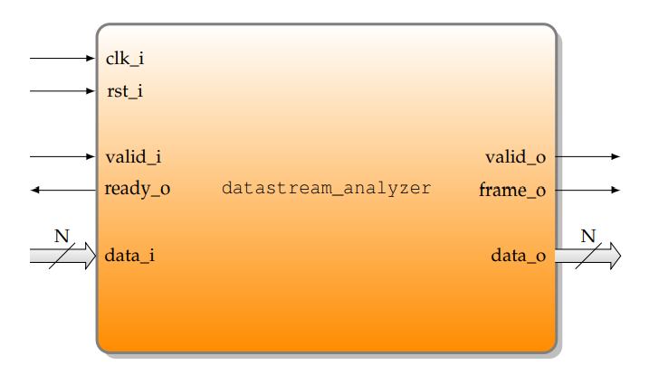
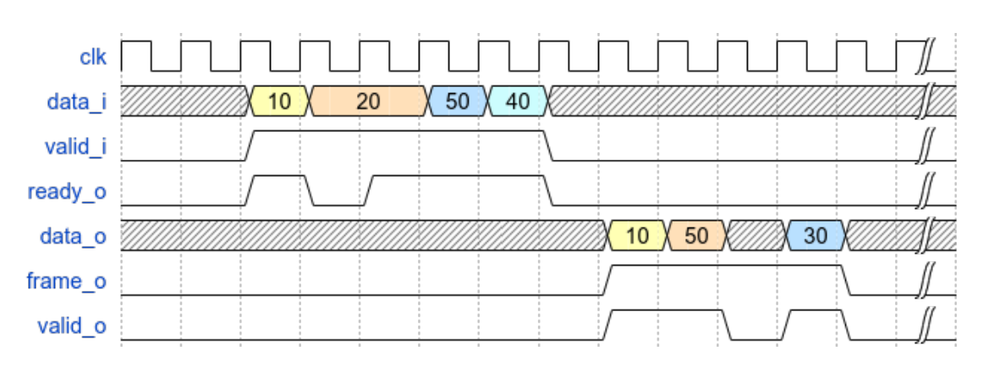
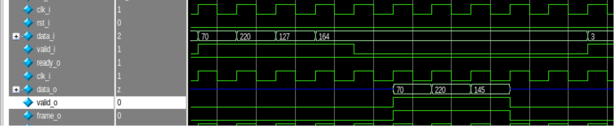

Labo 3 VSE

</h1>

07.01.2023</h3>

Miguel JALUBE</h3>

Leandro SARAIVA MAIA</h3>

# Contexte

Ce rapport est redigé dans le cadre du laboratoire 3 du cours de Vérification des systèmes embarqués de la HEIG-VD. Le laboratoire concerne un composant à tester en System Verilog.

## Objectif

Tester le fonctionnement d'un analyseur de données grâce à un banc de test dont le fonctionnement est semblable à UVM.

On releve deux types de tests à faire :
- Tests des données : Valident que les données en sortie soient cohérentes avec les entrées. (Assertions dans `datastream_analyzer_scoreboard.sv`)
- Tests de fonctionnement : Valident que le composant fonctionne correctement et respecte les timings. (Assertions dans `datastream_analyzer_assertions.sv`)

## Description du composant

L'analyseur prend en entrée des fenêtres de données d'une taille définie et retourne en sortie differents calculs sur ces données, notamment la valeur minimale, maximale et la moyenne de la fenêtre.

## Chronogramme de fonctionnement

Voici le chronogramme de fonctionnement comme décrit dans la consigne du laboratoire :

Voici le chronogramme de fonctionnement lors de la simulation :

On constate dans le chronogramme de la simulation la taille de la fenêtre est de 4 et envoi les valeurs 70, 220, 127, 164. Respectivement la valeur minimale, maximale et la moyenne sont 70, 220 et 145(entière). Le chronogramme respecte l'ordre défini pour les sorties, soit min, max puis moy.

# Plan de vérification

## Tests des données

| Test case       | Priority | Test                                                                                               | Verification criteria                           |
|-----------------|----------|----------------------------------------------------------------------------------------------------|-------------------------------------------------|
| Random          | 1        | Génère des datas aléatoires                                                                        | Min, max, avg correct                           |
| Ascending       | 1        | Génère des datas croissantes (0, 1, 2, ...)                                                        | Min = 0, Max = WINDOWSIZE, avg = WINDOWSIZE / 2 |
| Full 0          | 1        | Génère des datas contenant que des 0                                                               | Min = 0, Max = 0, Avg = 0                       |
| Full 1          | 1        | Génère des datas contenant que des 1                                                               | Min = 1, Max = 1, Avg = 1                       |
| Edge 1          | 1        | Génère des data contenant des 1 au LSB et au MSB                                                   | Min, max, avg correct selon calcul              |
| Edge 0          | 1        | Génère des data contenant des 0 au LSB et au MSB                                                   | Min, max, avg correct selon calcul              |
| Half 0 half 1   | 1        | Génère des datas contenant 50% de 0 et 50% de 1                                                    | Min, max, avg correct selon calcul              |
| Half 1 half 0   | 1        | Génère des datas contenant 50% de 1 et 50% de 0                                                    | Min, max, avg correct selon calcul              |
| Alternate 1 0   | 1        | Génère des datas contenant 1 puis 0 puis 1 puis 0 ...                                              | Min, max, avg correct selon calcul              |
| Alternate 0 1   | 1        | Génère des datas contenant 0 puis 1 puis 0 puis 1 ...                                              | Min, max, avg correct selon calcul              |

## Tests de fonctionnement

| Assert | Errno 0 | Errno 1 | Errno 2 | Errno 10 | Errno 11 | Errno 12 | Errno 13 | Errno 14 | Errno 15 |
|:-:|:-:|:-:|:-:|:-:|:-:|:-:|:-:|:-:|:-:|
| Si frame_o passe de 0 à 1, cela implique que frame_o est égal à valid_o pendant 3 cycles | PASS | PASS | PASS | FAIL | INACTIVE | FAIL | PASS | PASS | PASS |
| Si valid_i passe de 0 à 1, cela implique que valid_i est égal à ready_o pendant `WINDOWSIZE` cycles | PASS | PASS | PASS | PASS | PASS | PASS | PASS | PASS | PASS |

# Erreurs relevées
## ERRNO 0, 1 et 2
Aucune erreur car ce sont des cas d'utilisation différents du composant.

## ERRNO 10
valid_o est tout le temps à 0.  
Il devrait rester pendant 3 cycles à 1 lorsque frame_o est actif.

## ERRNO 11
frame_o est tout le temps à 0.  
Il devrait être actif jusqu'à ce que ready_o est été actif pendant 3 cycles.  
ready_o est actif pendant 3 cycles, cependant comme frame_o reste à 0, cela n'est pas compté.  
Dans notre cas, l'assertion ne peut même pas débuter car elle commencer à un flanc montant de frame_o.  

## ERRNO 12
Même problème que pour errno 10  

valid_o est tout le temps à 0.  
Il devrait rester pendant 3 cycles à 1 lorsque frame_o est actif.

## ERRNO 13

## ERRNO 14

## ERRNO 15

## Autres erreurs relevées
Si l'on essaye d'utiliser des valeurs nulles pour la taille de la fenêtre, le composant ne fonctionne pas correctement. De même pour la taille des données.

# Conclusion
